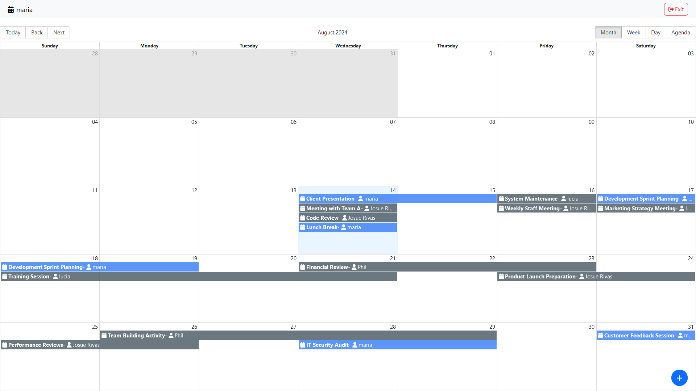

## Calendar Event Management Application

This application allows users to create, view, and manage calendar events. Users can specify details such as title, description, additional information, and date/time for the events. The calendar provides a visual representation of the scheduled events, helping users to keep track of their tasks and meetings.

### Features

- Create new events with detailed information
- View events in a monthly calendar format
- Edit and delete events
- Responsive design for various screen sizes

### Event Form

Users can add new events by filling out the form with the following fields:

- **Title and description**: Brief information about the event
- **Additional information**: Any extra details that might be relevant
- **Since date/time**: Start date and time of the event
- **Until date/time**: End date and time of the event

### Calendar View

The calendar view provides a monthly layout of all scheduled events, allowing users to see their commitments at a glance. Events are color-coded and display the event title and description on the respective dates.



### Usage

1. **Adding Events**:

   - Click on the "New Event" button to open the event form.
   - Fill in the event details and click "Save" to add the event to the calendar.

2. **Viewing Events**:

   - Events are displayed on the calendar based on their start date and time.
   - Hover over or click on an event to see more details.

3. **Editing and Deleting Events**:
   - Click on an event to open its details.
   - Use the edit button to modify the event details.
   - Use the delete button to remove the event from the calendar.

### Installation

To set up the application locally:

1. Clone the repository:
   ```bash
   git clone https://github.com/your-username/calendar-app-frontent.git
   ```
2. Navigate to the project directory:
   ```bash
   cd calendar-app
   ```
3. Install dependencies:
   ```bash
   npm install
   ```
4. Start the application:
   ```bash
   npm start
   ```

### Contributions

Contributions are welcome! Please fork the repository and submit a pull request for any enhancements or bug fixes.

### License

This project is licensed under the MIT License.
